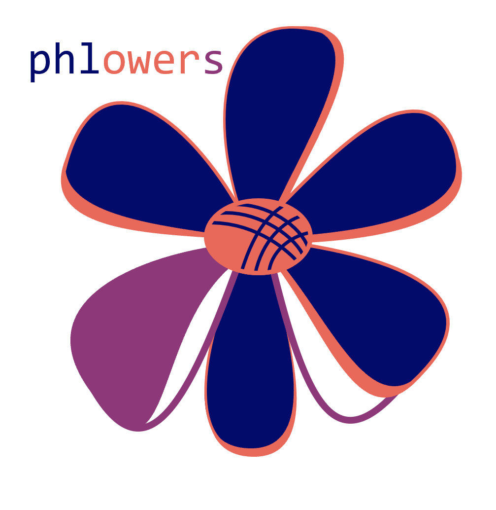

## Welcome to our garden full of...

🙋‍♀️ A short introduction - what is our organization all about?

Phlowers is an open-source library suite for studying power lines, written in Python.

The suite includes:
- **mecaphlowers**: a package dedicated to mechanical and geometrical calculations for overhead power lines.
- **thermohl**: a package focused on thermal analysis of power lines.

👩‍💻 Useful resources - where can the community find docs?

- [**mecaphlowers** functional documentation](https://phlowers.readthedocs.io/projects/mechaphlowers/en/latest/)

🌈 Contribution guidelines - how can the community get involved?

- Join the community on [Slack](https://join.slack.com/t/phlowerscommunity/shared_invite/zt-2vjm0dsv5-6ugYwU7_9TSP7j9hUVZH4A), ask for help, report bugs, help other users, provide feedback, present your use cases, etc.
- Contribute in the code soon; we just need a few months to establish a solid foundation.
